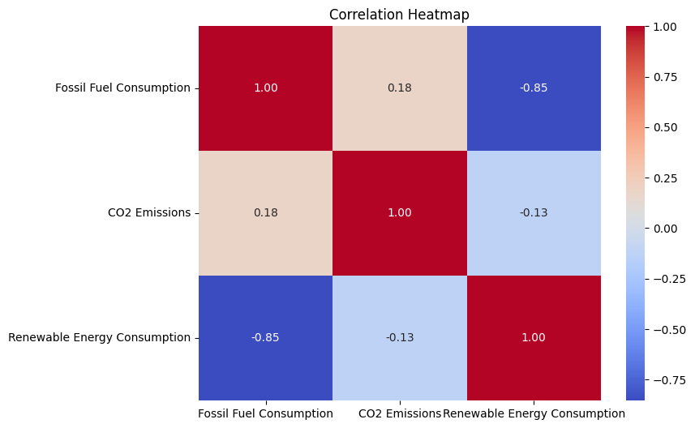
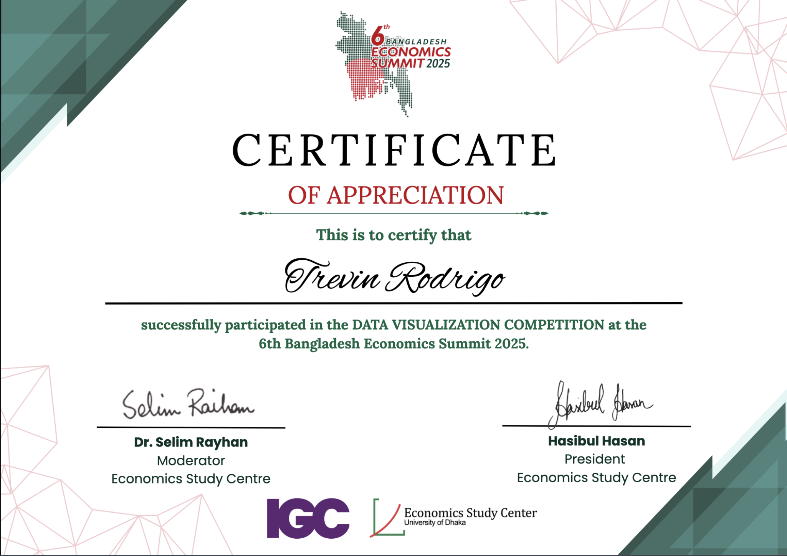

# 🌍 Global Energy Transition: Climate Impact Dashboard

🏆 **Winner - Data Visualization Competition**  
📍 *6th Bangladesh Economics Summit 2025*  
🎯 Theme: Climate and Trade

This project explores the global transition from fossil fuels to renewable energy and its impact on CO₂ emissions across decades (1960–2023). It was awarded first runner-up in a data visualization competition organized by the Bangladesh Economics Summit.

## 📈 Highlights

- 🔥 Fossil Fuel vs Renewable Energy Usage (Global + USA)
- 🌡️ Correlation Heatmap between fuel types and CO₂ emissions
- 📉 Declining fossil fuel use and rising renewables (USA)
- 🌍 Tableau Dashboard for Global Performance
- 📊 Country-specific energy and emissions comparisons

## 🖼️ Visual Samples

**🔻 Correlation Heatmap:**  
Shows the relationship between various fuel types and CO₂ emissions.

**📊 Tableau Dashboard Overview:**  
Interactive global view of energy production vs emissions by country and income group.

## 🛠 Tools Used

- Tableau (for interactive dashboards)
- Python (data cleaning + charting in notebook)
- World Bank & UN Comtrade datasets

## 📘 Storyline

The project titled **"The Fossil Fuel Paradox"** uncovers how:
- Renewable energy adoption **correlates negatively** with fossil fuel use.
- CO₂ emissions **vary by economic groupings**, with wealthier nations shifting faster.
- The USA shows strong signs of energy transition since 2004.

> 🌐 View Full Interactive Dashboard:  
> [🔗 Global Energy Transition & Climate Impact (Tableau)](https://public.tableau.com/app/profile/trevin.rodrigo/viz/GlobalEnergyTransitionClimateImpact/GlobalEnergyTransitionClimateImpact)

## 📄 Submission Files

- 📊 `fuel consumption vs co2 emissions.ipynb`: Python notebook with EDA & plotting
- 🗃 `GlobalEnergyAnalysis.docx`: Full story with annotated visuals (submitted version)
- 📦 `Global Energy Analysis.zip`: Complete data + visuals package

## 🧠 Key Insights

- Trade-offs exist: High fossil fuel use = low renewables.
- Decarbonization progress is regionally unequal.
- Renewable energy growth links to reduced CO₂ intensity.

---

> 🥇 This project secured me a top spot among regional and international entries.  
> 🧾 Certificate of Achievement provided by BES 2025.

